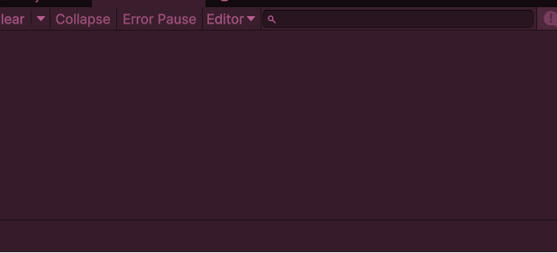
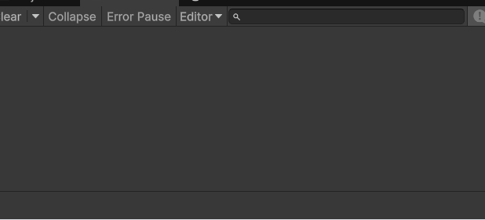
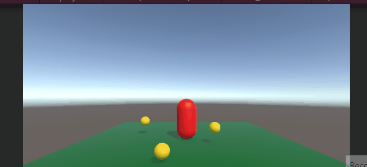

# opdracht 1 code conventions
in deze gif zie je hoe in de console objecten in en uit een list woorden gehaald en gelogged worden in de console

heg goevend met code conventions 

# opdracht 2 mermaid
(niet af tot nu toe)

# opdracht 3 Data structures
in de gif kan je zien hoe meerde scribable objects in de list zitten en dat ze gifeltered kunnen woorden op object type 

heb geleerd hoe je met enums, scriptable objects, structs en classes moet werken heb ook geofend en wat stacks en heaps zijn
in de code staan meerdere scriptable objects die veschillden properties hebben

# opdracht 4 delegates
in de gif loopt de speler rond en pakt dingen op terwijl de ui het update

in de code update de ui met een action event die getriggered word op een ontriggerenter 

